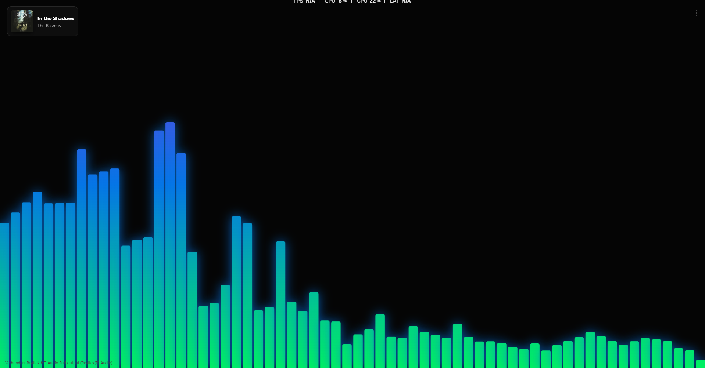
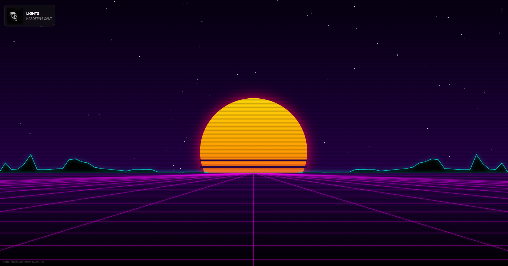
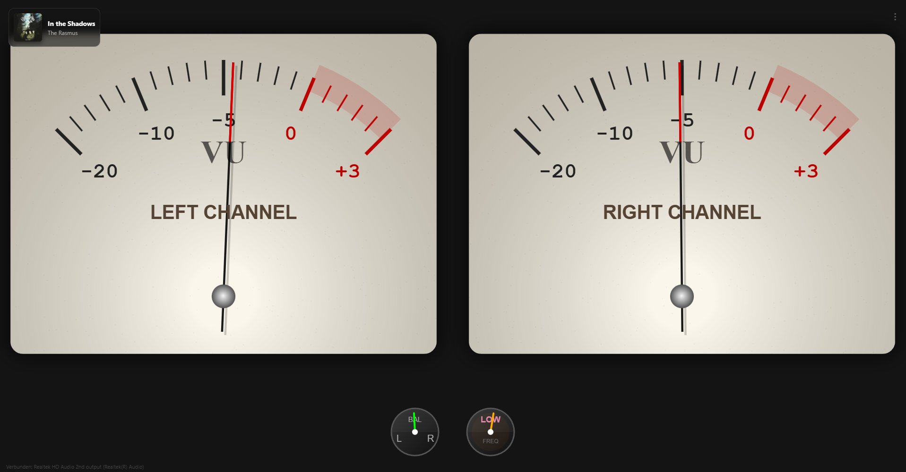
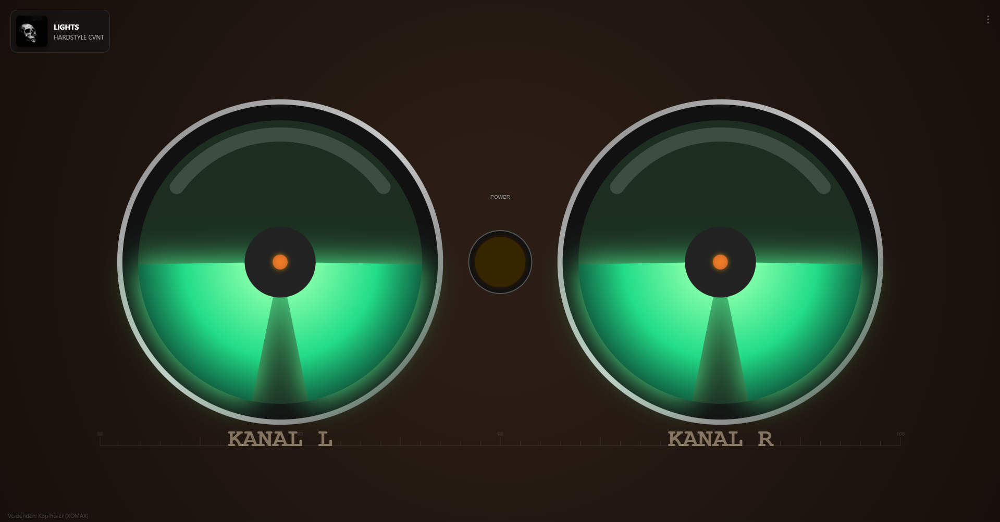

# 🎵 Pro Visualizer


> **A high-performance, real-time desktop audio visualizer built with Python and Web technologies.**

[](https://www.python.org/)
[](https://www.microsoft.com/)
[](LICENSE)

**Pro Visualizer** captures your system audio (Loopback) in real-time and renders stunning, hardware-accelerated visualizations using a web-based frontend. It features retro aesthetics, media information overlay, and deep customization.

---

## ✨ Features

*   **System Audio Capture:** Visualizes exactly what you hear (Spotify, YouTube, Games, etc.) using `soundcard`.
*   **8+ Unique Visual Styles:** From Retro Synthwave to Analog VU Meters.
*   **Media Integration:** Automatically displays the current playing song and cover art (Windows Media API).
*   **Hardware Acceleration:** Uses `pywebview` for smooth 60FPS rendering.
*   **Deep Customization:** Adjust sensitivity, bass-trigger range, and layout positions on the fly.
*   **Zero-Lag UI:** Audio processing runs on a dedicated thread separate from the rendering engine.

---

## 📸 Gallery

| **Neon Flow** | **Synthwave 80s** |
|:---:|:---:|
|  |  |
| *Classic spectrum analyzer* | *Retro sun and grid landscape* |

| **Analog VU Meter** | **Magic Eye (Tube)** |
|:---:|:---:|
|  |  |
| *Realistic analog physics* | *Vintage vacuum tube EM34 simulation* |

---

## 🚀 Installation

### Prerequisites
*   Python 3.8 or higher
*   Windows 10/11 (Required for Media Info & Loopback audio)

### 1. Clone the Repository
```bash
git clone https://github.com/cosyfluf/pro-visualizer.git
cd pro-visualizer
```

### 2. Install Dependencies
You can install all required packages using the requirements file:
```bash
pip install -r requirements.txt
```

### 3. Add Assets
Ensure you have the necessary image assets:
*   `styles/*.js` (Visualization logic)
*   `static/nyan-cat.gif` (Required for Nyan Cat mode)

---

## 🎮 Usage

### Start the App
Run the main Python script:
```bash
python visualizer.py
```

### Audio Setup
1.  On the first launch, the console will list available audio devices.
2.  Type the **ID** of your system's output device (usually named "Stereo Mix", "Speakers", or "CABLE Input" if using VB-Audio).
3.  The app will remember your choice in `config.json` for next time.

### Controls
*   **Open Settings:** Click the `⋮` button in the top-right corner.
*   **Toggle Fullscreen:** Double-click anywhere on the window.
*   **Save Settings:** Click "Speichern" or press `Ctrl + S`.
*   **Close App:** Close the window or press `Ctrl + C` in the terminal.

---

## 🎨 Visualization Modes

1.  **Neon Flow:** Clean, modern bars with gradient coloring.
2.  **K.I.T.T.:** Knight Rider style center-out red bars.
3.  **LED Matrix:** Segmented blocks with green/yellow/red peak hold.
4.  **Analog VU:** High-fidelity vintage needle meters with ballistics.
5.  **Magic Eye:** Simulation of a vintage EM34 radio tuning tube.
6.  **Synthwave 80s:** A 3D moving grid with a pulsating retro sun.
7.  **HoloRenderer:** Sci-fi radial gravity core with particles.
8.  **Nyan Cat:** Because why not? 🐱🌈

---

## ⚙️ Configuration

Settings are saved automatically to `config.json`.

| Setting | Description |
| :--- | :--- |
| **Style** | Choose the active visual renderer. |
| **Sensitivity** | Master volume gain (0.1 - 3.0). |
| **Bass Range** | How wide the frequency band for bass detection is. |
| **Bass Offset** | Start frequency for bass detection (Hz offset). |
| **Bass Sens** | Sensitivity specifically for bass-reactive elements (e.g., the Sun pulse). |

---

## 🛠️ Project Structure

```text
pro-visualizer/
├── visualizer.py       # Main Python entry point (Backend)
├── requirements.txt    # Python dependencies
├── config.json         # User settings (Generated automatically)
├── index.html          # Main Frontend Interface
├── app.js              # Frontend Logic (WebSocket/Bridge)
├── static/             # Images (Nyan cat, Icons)
├── screenshots/        # Images for README.md
└── styles/             # Visualization Renderers (JS)
    ├── neon.js
    ├── kitt.js
    ├── vu.js
    ├── synthwave.js
    └── ...
```
## ⚠️ Troubleshooting

**"No Audio Detected"**
*   Ensure you selected a **Loopback** device (e.g., "Speakers (Loopback)") and not a Microphone.
*   Check your Windows Sound Settings to ensure the device is active.

**"ImportError: No module named winsdk"**
*   Ensure you are on Windows. If on Linux/Mac, remove the `winsdk` import block in `visualizer.py` (Media Info will be disabled).


## 📄 License

Distributed under the MIT License. See `LICENSE` for more information.

---

**Created with ❤️ by [cosyfluf](https://github.com/cosyfluf)**
